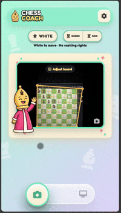
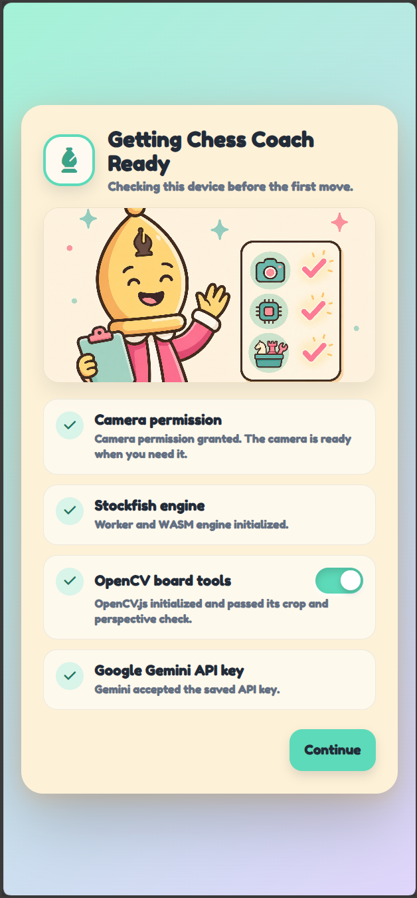
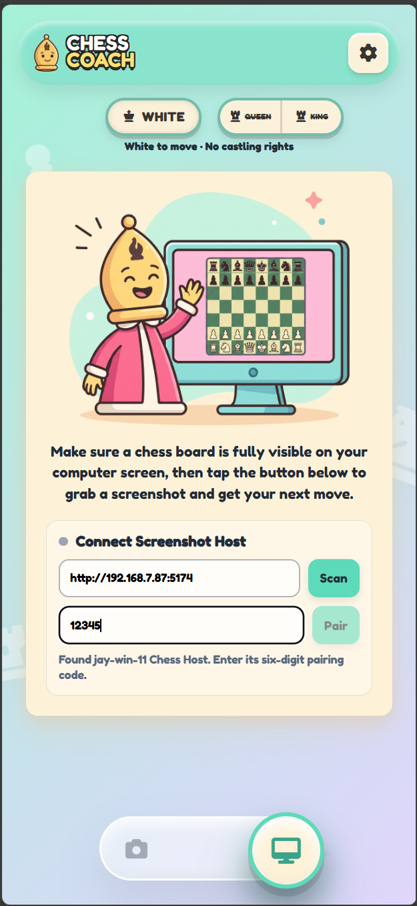

# Chess Coach

Chess Coach is an experimental AI application that combines vision-capable Large Language Models (LLMs) and local chess engine analysis to provide real-time, interactive chess coaching from camera photos of physical boards or desktop screenshots.

Built as a local-first React and TypeScript Progressive Web App, it uses OpenCV.js and WebAssembly-compiled Stockfish 18 directly in the browser alongside multimodal AI APIs (Google Gemini & OpenRouter) for board recognition and strategic analysis. An optional Node.js LAN daemon provides zero-configuration desktop screen pairing.

<h2 align="center">
  <a href="https://ai-chess-coach.pages.dev/"><strong><u>Live Webapp</u></strong></a><br />
  (<a href="https://ai-chess-coach.pages.dev/">https://ai-chess-coach.pages.dev/</a>)
</h2>

<p align="center">
  It uses a camera, so access it from a phone or a device with a webcam.
</p>

<p>
  
  
  
</p>

## Running from source

The live webapp is a complete client-side PWA app—nothing is sent to any servers, and all settings and info are stored locally on your device. It only sends the camera captured image to the configured LLM when you ask it to.

If you still don't trust it, you can download the source and follow the quick start below, or ask your favorite coding agent to analyze the code and tell you how to run it.

It also has an optional host service where you can run the service locally and pair the web client with it. Instead of using the device camera to take a picture, it will take a screenshot of the host computer and send the screenshot for AI analysis.

## How it works

1. **Capture**: The browser captures a camera frame or requests a screenshot from a paired LAN host.
2. **Crop & Prep**: OpenCV.js detects board boundaries and perspective-corrects the 2D image; raw frames fallback gracefully if needed. Images are saved locally in IndexedDB.
3. **Vision Recognition**: The selected LLM provider scans the board, identifies piece coordinates, and constructs a standard FEN string.
4. **Engine Evaluation**: Stockfish 18 (Wasm) analyzes the FEN locally, outputting the best move and principal variation line.
5. **AI Coaching**: The LLM synthesizes Stockfish's analysis into concise, actionable coaching advice explaining _why_ the move is strong and what tactics to watch for.

## Quick start

```bash
git clone https://github.com/jayl-dev/ai-chess-coach
cd chess-coach
npm install
npm run dev
```

Open `http://localhost:5173`. Vite listens on all interfaces during development, but camera permission generally requires localhost or HTTPS.

Add an API key from the app's Settings screen. Keys and settings are stored in browser storage for the current origin.

## Vision Providers & Local LLM Setup

Chess Coach supports cloud vision providers as well as local OpenAI-compatible vision models:

### 1. Cloud Vision APIs
* **Google Gemini (Direct)**: Fast and highly accurate for both physical board photos and digital screenshots.
* **OpenRouter**: Access to multimodal models such as Gemini 2.5 Flash, GPT-4o, and Claude 3.5 Sonnet.

### 2. OpenAI-Compatible & Local LLMs (Ollama / LM Studio)
You can run vision models 100% locally by selecting **OpenAI Compatible** in Settings:
* **Ollama**: Set Base URL to `http://localhost:11434/v1`
* **LM Studio / vLLM**: Set Base URL to `http://localhost:1234/v1` (or your local server port)
* **Prompt Format**: Choose **Vision LLM Prompt**
* **Recommended Local Models**: `qwen2.5-vl:7b` or `llama3.2-vision:11b`.

### 3. Specialized Model: LiveChess2FEN
Supports the specialized [LiveChess2FEN](https://github.com/jayl-dev/LiveChess2FEN) OpenAI-compatible image-to-FEN service:
* **Prompt Format**: Choose **LiveChess2FEN Prompt** (with `a1_pos` parameter).
* **Target Usage**: LiveChess2FEN is designed and optimized specifically for physical 3D chess boards rather than digital screen captures.
* **Accuracy Note**: In benchmarking and testing, modern general-purpose vision LLMs (such as Gemini 2.5 Flash, GPT-4o, or Qwen 2.5 VL) generally outperform specialized vision models on both physical and digital board recognition—especially when **Recognition Effort** is set to **High** (which enables square-by-square self-verification).

## Optional screenshot host

Camera mode does not need a server. To capture a chess board shown on a Windows or macOS computer, run the optional host on that computer in a second terminal:

```bash
cp .env.example .env
npm run dev:host
```

On PowerShell, use `Copy-Item .env.example .env` instead of `cp`.

The host listens on port `5174` by default, prints its LAN addresses and a six-digit pairing code, and advertises `_chess-coach._tcp.local` through mDNS. In the PWA, switch to screen mode, scan or enter the displayed host address, and pair with the code.

Pairing tokens are kept in host memory. Restarting the host requires pairing again.

### Browser and LAN limitations

Browsers cannot directly enumerate DNS-SD services. Chess Coach probes saved/common addresses and also accepts a manually entered LAN address. A public HTTPS PWA connecting to a local HTTP host additionally depends on the browser's Local Network Access support and permission.

If local HTTP access is blocked, provide a certificate trusted by the PWA device through `HOST_HTTPS_CERT` and `HOST_HTTPS_KEY`, or open the PWA from the local network.

Screen capture implementations:

- Windows: PowerShell and `System.Drawing`
- macOS: the built-in `screencapture` utility, with screen-recording permission

## Deploy the PWA to Cloudflare

The repository includes a Wrangler configuration for [Cloudflare Workers Static Assets](https://developers.cloudflare.com/workers/static-assets/) with SPA fallback routing. It deploys only `client/dist`; the optional screenshot host remains a local service.

Authenticate once:

```bash
npx wrangler login
```

Then build and deploy:

```bash
npm run deploy:cloudflare
```

To test the production build through Wrangler first:

```bash
npm run preview:cloudflare
```

Change the `name` in `wrangler.jsonc` if `chess-coach` is already taken in your Cloudflare account. Wrangler creates or updates the Worker and uploads the static assets. The SPA fallback ensures direct navigation to client-side routes continues to return `index.html`.

No API key is required at build or deployment time. Users provide their own key in the deployed app.

## Privacy and API keys

- API keys are stored in the browser for the app's origin.
- Production keys must never be placed in a `VITE_*` environment variable; Vite embeds those values in public JavaScript.
- Development fallback keys may be placed in the ignored `.env.development.local` file. They are visible to every browser that can reach that development server.
- Captured images are sent directly to the selected OpenRouter or Gemini model because vision recognition requires it.
- Captured images and API keys are not sent to the optional Chess Coach host.
- Before publishing, confirm that `.env`, `.env.*.local`, `.dev.vars*`, and `.data/` remain untracked.

# Credits

Most of the code was generated — I have multiple coding subscriptions and wanted to burn some tokens :)
I used OpenCode, Codex, Antigravity, Claude Code, and a mix of models including GPT‑5.6, Gemini, GLM 5.2, and others.

The graphic assets, in case you’re wondering, were also generated, with a bit of manual tweaking.

This project was mainly a sandbox for learning and experimenting with different coding agents and LLMs.
